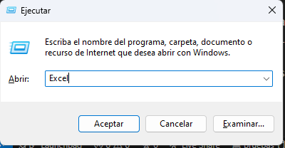
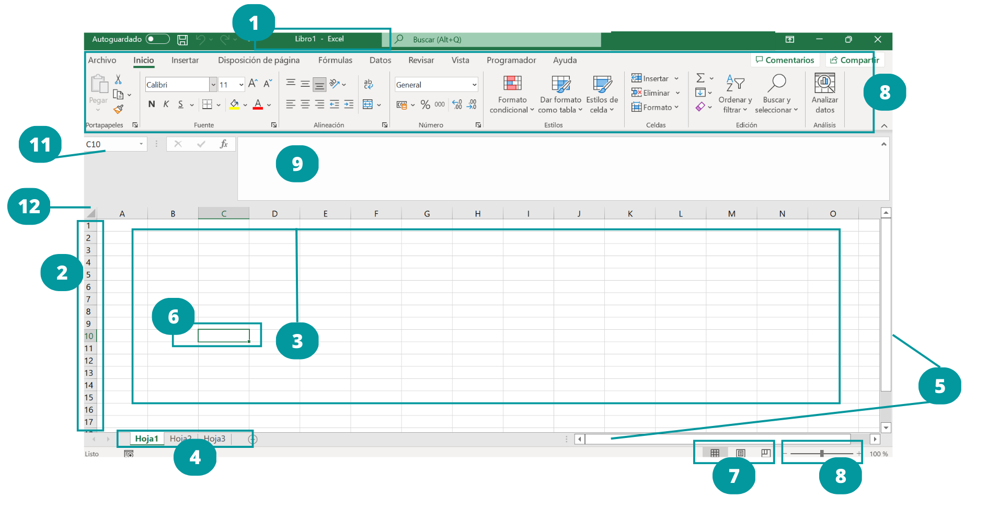
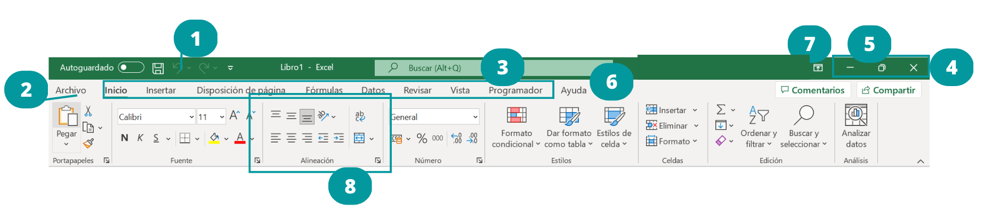

# **El Poder de las Hojas de Cálculo**

Microsoft Excel es una de las herramientas más populares y versátiles para el manejo de datos. Conocido por su capacidad para procesar información, realizar cálculos y generar gráficos, Excel se ha convertido en un aliado indispensable en la oficina, el hogar y el aula. Este repo te llevará a explorar a fondo qué es Excel y desglosará sus funciones principales, así como los aspectos básicos para que saques el máximo provecho de esta herramienta.

## **¿Qué es Excel?**

Excel es una aplicación desarrollada por Microsoft que permite trabajar con hojas de cálculo electrónicas. Su diseño está pensado para manipular, analizar y visualizar datos de manera eficiente. Desde operaciones matemáticas simples hasta análisis de datos complejos, Excel ofrece un entorno amigable que combina potencia y flexibilidad.

## Apertura de Excel
- Opcion 1

    - Activa el buscador de aplicaciones usando \<Mayus + Q>
    - En el buscador escribir la palabra Excel. Posterioermente da doble clic al icono Excel o presiona la tecla \<Enter>

    

- Opcion 2
    - Desde la ventana ejecutar \<Win + R> escribe la palabra Excel y presiona la tecla \<Enter>

    
## **Interfaz de Usuario en Excel**

Al abrir Excel, te encontrarás con una interfaz intuitiva que incluye:
- **Cinta de opciones:** Contiene herramientas organizadas en pestañas como *Inicio*, *Insertar*, *Datos* y *Fórmulas*.
- **Barra de fórmulas:** Muestra y permite editar el contenido de una celda seleccionada.
- **Hojas de cálculo:** Son tablas formadas por filas y columnas donde puedes introducir y organizar datos.
- **Vista rápida:** Accesos directos para abrir, guardar y deshacer.

Familiarizarse con esta interfaz es esencial para usar Excel de manera efectiva.

1.  Barra de título: Muestra el nombre del libro y el nombre de la aplicación en este caso Microsoft Excel, por ejemplo cuando se inicia Excel el nombre es Libro1.

2. Filas: cada uno de los espacios horizontales en los que se divide una hoja de cálculo. Se identifican con números.

3. Columnas: cada uno de los espacios verticales en los que se divide una hoja de cálculo. Se identifican con letras.

4. Etiquetas de hojas: cada libro de Excel 2010 presenta tres hojas de cálculo. Cada hoja se identifica con una etiqueta que, de forma predeterminada, recibe el nombre de Hoja1, Hoja2 y Hoja3, respectivamente, aunque se pueden modificar estos nombres, así como agregar o eliminar hojas.

5. Barras de desplazamiento: Permite moverse dentro de la hoja de cálculo.

6. Celda activa: Es la celda seleccionada. Cada celda representa una posición específica dentro de la hoja de cálculo que indica la intersección entre una columna y una fila. La celda activa se identifica porque cuando está seleccionada se muestra con un recuadro doble.

7. Vistas del libro: Hay varias maneras de ver las hojas de trabajo en Excel. Cada una de ellas lo ayuda a trabajar en distintas situaciones.  Tres se encuentran en el menú Ver. Dos están en el menú Ventana y una más en el menú Archivo.

8.  Herramientas Zoom: Sirve para aumentas o disminuir el tamaño de lo que se ve en la pantalla.

9. Barra de fórmulas: muestra el contenido de la celda activa. Si el contenido de esa celda se obtuvo a partir de una fórmula, muestra la fórmula. Desde aquí también se puede escribir y editar fórmulas y funciones.

10. Cinta de opciones: La cinta de opciones se ha diseñado para ayudarle a encontrar fácilmente los comandos necesarios para completar una tarea. Los comandos se organizan en grupos lógicos, que se reúnen en fichas. Cada ficha está relacionada con un tipo de actividad (como escribir o diseñar una página). Para reducir la confusión, algunas fichas sólo se muestran cuando es necesario.

11. Cuadro de nombres: muestra la referencia a la celda activa, como por ejemplo, A1. Desde aquí también se pueden asignar nombres personalizados para identificar las diferentes celdas con las que se está trabajando.

12. Selector: Si se hace clic con el ratón aquí, se seleccionará la hoja de cálculo en su totalidad, es decir, completa.

13. Celda: Una de las características principales de Excel, es que en el centro de su pantalla principal se muestra una matriz de dos dimensiones, que está formada por columnas y filas como se ha visto, formando una celda, que básicamente es la intersección de una columna y una fila. 

1. Ficha Archivo: abre la Vista Backstage, que permite administrar documentos y datos relacionados sobre ellos, como crear, guardar y enviar documentos, inspeccionar documentos para comprobar si tienen metadatos ocultos o información personal, o establecer opciones específicas.

2. Barra de herramientas de acceso rápido: es una barra de herramientas personalizable que contiene un conjunto de comandos independientes de la ficha de la Cinta de opciones que se muestra.

3. Fichas: funcionan como indicadores generales que contienen grupos y comandos específicos para ejecutar determinadas acciones.

4. Botones de control: permiten minimizar, maximizar, restaurar o cerrar la aplicación que se está ejecutando.

5. Botones de control del libro activo: al igual que los botones de control de la ventana en la que se ejecuta la aplicación, los botones de control del libro permiten minimizarlo, maximizarlo, restaurarlo o cerrarlo.

6. Ayuda: abre la página de Ayuda de Microsoft Office.

7. Botón de control de la Cinta de opciones: muestra u oculta la Cinta de opciones. Si la Cinta de opciones está oculta, sólo se muestran los nombres de las fichas.

8. Grupos lógicos: dentro de cada ficha, los grupos lógicos se organizan agrupando a los comandos que tienen funciones similares o relacionadas.

---

## **Celdas, Filas y Columnas**

- **Celdas:** Son la unidad básica de Excel, representadas por la intersección de una fila y una columna. Cada celda tiene una dirección única (como A1).
- **Filas:** Van numeradas y se usan para organizar datos horizontalmente.
- **Columnas:** Están etiquetadas con letras y organizan los datos verticalmente.

Puedes realizar operaciones como:
- Insertar o eliminar celdas.
- Ajustar el ancho de columnas y la altura de filas.
- Combinar celdas para crear encabezados.

---

## **Guardar y Abrir Archivos en Excel**

Excel te permite guardar tu trabajo en diferentes formatos, como:
- **.xlsx:** Formato estándar.
- **.xls:** Versión compatible con Excel antiguo.
- **.csv:** Para archivos de texto con valores separados por comas.

Usa la función de *Guardar como* para elegir el formato adecuado, y *Abrir* para trabajar con archivos existentes.

---

## **Tipos de Datos y su Introducción**

En Excel puedes trabajar con:
- **Texto:** Para nombres, categorías o etiquetas.
- **Números:** Para cálculos o estadísticas.
- **Fechas y horas:** Con formatos específicos.
- **Datos booleanos:** Verdadero/Falso.
  
Introduce datos directamente en una celda o utiliza copiar y pegar para agilizar el proceso.

---

## **Uso Básico de Fórmulas**

Las fórmulas son el alma de Excel. Puedes realizar cálculos como:
- **Suma:** `=SUM(A1:A10)`
- **Promedio:** `=AVERAGE(B1:B10)`
- **Multiplicación:** `=A1*B1`

Excel ofrece un sinfín de funciones que van desde cálculos simples hasta análisis avanzado de datos.

---

## **Formato de Celdas**

El formato de celdas mejora la presentación de datos:
- **Tipo de dato:** Número, moneda, porcentaje, etc.
- **Alineación:** Izquierda, derecha o centrado.
- **Colores:** Para resaltar información importante.
- **Bordes:** Para definir secciones en tus tablas.

El formato ayuda a que tus hojas sean más comprensibles y visualmente atractivas.

---

## **Uso del Portapapeles y Comandos Básicos**

Con el portapapeles puedes copiar, cortar y pegar datos entre celdas, incluso manteniendo su formato. Algunos atajos básicos incluyen:
- **Ctrl + C:** Copiar.
- **Ctrl + X:** Cortar.
- **Ctrl + V:** Pegar.
- **Ctrl + Z:** Deshacer.

Estos comandos aceleran el flujo de trabajo.

---

## **Ordenar y Filtrar Datos**

Para organizar información:
- **Ordenar:** Por valores ascendentes, descendentes o personalizados.
- **Filtrar:** Mostrar solo los datos que cumplen ciertos criterios.

Ambas funciones son útiles para trabajar con grandes conjuntos de datos.

---

## **Validación de Datos**

La validación garantiza que las entradas sean correctas. Puedes:
- Restringir valores a un rango numérico.
- Permitir solo fechas específicas.
- Usar listas desplegables para opciones predefinidas.

Esto minimiza errores al trabajar con datos.

---

## **Funciones Principales de Excel**

### **1. Creación de Gráficos en una Sola Celda**
Excel ofrece **gráficos Sparkline**, pequeñas visualizaciones dentro de una celda que resumen datos. Estos gráficos son ideales para tendencias, como ingresos mensuales o cambios porcentuales, y se pueden personalizar con colores y estilos.

---

### **2. Filtros y Segmentación**
Los filtros te permiten trabajar con datos relevantes. Por ejemplo:
- Aplicar filtros por texto, número o fecha.
- Usar segmentaciones en tablas dinámicas para simplificar la navegación por grandes conjuntos de datos.

---

### **3. Control de Iconos y Visualización de Datos**
El formato condicional te ayuda a resaltar información clave mediante:
- Iconos como flechas, semáforos o barras de progreso.
- Colores que indican tendencias (rojo para valores bajos, verde para altos).

---

### **4. Recopilación de Datos para Tablas Dinámicas**
Las tablas dinámicas son ideales para resumir datos:
- Arrastra campos para organizar información.
- Calcula automáticamente promedios, totales o porcentajes.
- Crea informes interactivos.

---

## **Conclusión**

Microsoft Excel es mucho más que una hoja de cálculo; es una herramienta poderosa para el análisis y visualización de datos. Desde sus funciones básicas hasta características avanzadas como tablas dinámicas y gráficos Sparkline, Excel transforma cómo trabajamos con información. Dominar sus capacidades no solo mejora tu productividad, sino que abre un mundo de posibilidades para tomar decisiones más informadas. ¡Empieza hoy y descubre todo lo que Excel puede hacer por ti!